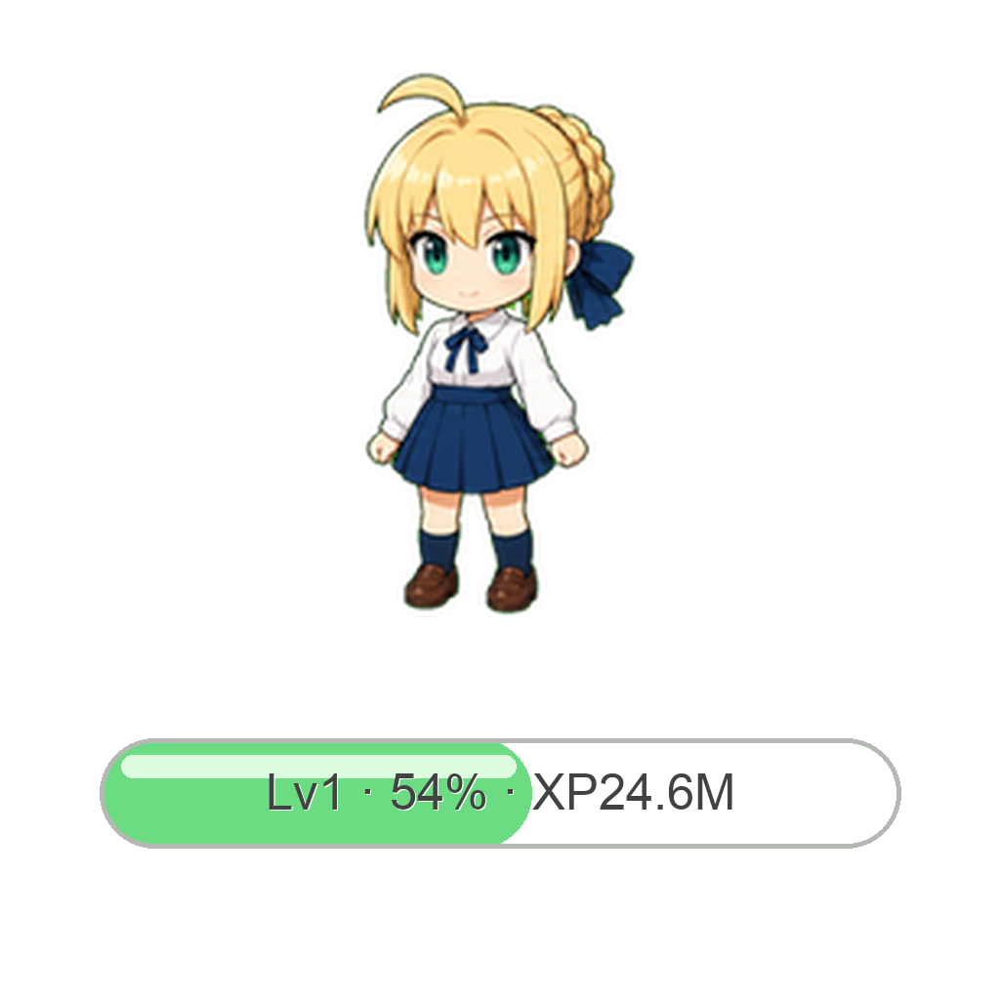

# Codex Context Pet Bar

Codex Context Pet Bar 是一个 macOS 悬浮小组件，用来显示当前 Codex 对话的“上下文能量”。它会读取你本机 Codex 保存的对话日志，估算当前对话用了多少上下文窗口，并用类似宠物经验条的方式显示出来。

这个项目的目标很简单：让你不用打开调试信息，也能快速判断一个 Codex 对话是否快要压缩，或者是否应该新开一个对话窗口。



## 它显示什么

默认情况下，小组件会收成一根短进度条，放在 pet 附近时不容易挡住内容。短进度条里会显示 `Lv · % · XP`。

点击短进度条后，会展开完整面板。展开后点击面板空白区域可以收回；按住拖动可以移动位置。

展开后会显示这些内容：

- `上下文能量`：当前对话已经塞进模型上下文的内容量，可以理解成一条能量条。
- `Lv`：压缩等级。检测到明显的上下文压缩后会增加。它不是游戏等级，而是“这个对话整理过几次记忆”的近似计数。
- `%`：当前上下文占用比例。例如 `72%` 表示当前对话大约用了 72% 的上下文窗口。
- `XP`：这个对话累计消耗的 token 数，像经验值。聊得越久、执行任务越多，XP 越高。
- 状态提示：
  - `状态很好`：当前上下文还比较健康。
  - `快整理记忆了`：接近压缩区间，继续聊可能会触发自动压缩。
  - `建议开新窗口`：上下文已经很高，适合开新对话或主动压缩。

## 自动和切换

默认是 `自动` 模式。

自动模式只盯最近活跃的 Codex 对话。你在哪个 Codex 对话里继续发送消息或让 Codex 执行任务，它就会跟随那个对话的数据。

`切换` 按钮用于手动查看最近几个对话。点击后会弹出最近对话菜单，选择某个对话后才读取那个对话的数据。这样不会反复扫描所有历史对话，也避免误点后要把每个对话都轮一遍。

再次点击 `自动`，就会回到自动跟随最近活跃对话。

## 资源占用

这个小组件不会联网，也不会向任何服务上传内容。它只读取你本机的 Codex 日志文件。

当前策略是：

- 挂机时，每 12 秒只检查一次当前对话日志的文件大小和修改时间。
- 如果文件没有变化，就不读取日志内容。
- 如果文件有新内容，只读取新增部分，不会每次从头读取整个大日志。
- 手动切换时，只读取你选择的那个对话。

所以正常使用时资源占用很低。它适合一直放在桌面 pet 附近。

## 适用范围

当前版本适用于：

- macOS
- Apple Silicon Mac，也就是 M 系列芯片，例如 M1、M2、M3、M4
- 本地安装过 Codex Desktop
- Codex 日志目录在默认位置：`~/.codex/sessions`

当前版本不适合：

- Windows
- Linux
- Intel Mac，除非你自己重新编译成 x86_64 或 universal app
- 没有本地 Codex 日志的环境

## 使用方法

最简单的方式是下载 Release 里的压缩包：

1. 打开 GitHub 项目的 `Releases` 页面。
2. 下载 `Codex Context Pet Bar.zip`。
3. 解压后得到 `Codex Context Pet Bar.app`。
4. 双击打开。

如果 macOS 提示“无法打开，因为无法验证开发者”，这是因为这个 app 没有做 Apple 开发者签名。可以这样打开：

1. 右键点击 `Codex Context Pet Bar.app`。
2. 选择 `打开`。
3. 在弹窗里再次选择 `打开`。

关闭方式：

- 点击小组件右上角的 `×`。
- 或运行 `scripts/Stop Codex Context Pet Bar.command`。

## GitHub Release 下载包

把代码 push 到 GitHub 仓库，只会更新代码页面，不会自动生成下载包。

`Releases` 是 GitHub 的“下载包发布区”。本项目用 `scripts/Build Release.command` 生成 `.zip`，再上传到 Release。

本项目建议上传的文件是：

```text
dist/Codex Context Pet Bar.zip
```

创建 Release 的步骤：

1. 打开 GitHub 仓库页面。
2. 点击右侧或顶部的 `Releases`。
3. 点击 `Draft a new release`。
4. `Choose a tag` 填 `v0.7` 或更高版本号。
5. Release title 填 `Codex Context Pet Bar v0.7`。
6. 把 `dist/Codex Context Pet Bar.zip` 拖进去上传。
7. 点击 `Publish release`。

发布后，别人就能在 Releases 页面下载 app。

## 项目目录结构

整理后的目录如下：

```text
.
├── README.md
├── app/
│   └── Codex Context Pet Bar.app
├── assets/
│   └── icons/
│       ├── AppIcon.icns
│       ├── CodexContextPetBar.iconset/
│       └── CodexContextPetBarIcon.png
├── legacy/
│   ├── Launch Codex Context Pet Bar.applescript
│   └── codex_context_pet_bar.py
├── scripts/
│   ├── Build Release.command
│   ├── Launch Codex Context Pet Bar.command
│   └── Stop Codex Context Pet Bar.command
└── src/
    └── CodexContextPetBar.swift
```

各目录用途：

- `src/`：正式源码。当前主程序是 `src/CodexContextPetBar.swift`。
- `app/`：已经编译好的 macOS app，可以直接运行。
- `assets/icons/`：app 图标源文件、iconset 和 `.icns`。
- `scripts/`：给新手使用的双击脚本，用来启动、停止和打包。
- `legacy/`：早期 Python/Tk 原型，保留作参考，已经不推荐使用。
- `dist/`：本地打包输出目录，不提交到 Git。

## 从源码重新编译

最简单的方式是双击：

```text
scripts/Build Release.command
```

这个脚本会做三件事：

- 用 macOS 自带 Swift 编译器编译 `src/CodexContextPetBar.swift`。
- 把 `assets/icons/AppIcon.icns` 复制进 app。
- 生成 `dist/Codex Context Pet Bar.zip`。

如果你想手动编译，可以用：

```bash
swiftc src/CodexContextPetBar.swift -o "app/Codex Context Pet Bar.app/Contents/MacOS/CodexContextPetBar"
```

然后重新打开 app：

```bash
open "app/Codex Context Pet Bar.app"
```

如果已经有旧进程在运行，可以先停止：

```bash
pkill -f CodexContextPetBar
```

## 打包 Release zip

推荐直接运行：

```bash
./scripts/Build\ Release.command
```

生成后，把 `dist/Codex Context Pet Bar.zip` 上传到 GitHub Releases。

## 隐私说明

这个 app 只在本机读取 Codex 日志文件，不联网、不上传、不写入 Codex 配置。

它会读取的主要目录是：

```text
~/.codex/sessions
~/.codex/session_index.jsonl
```

这些文件里可能包含你的对话元数据和部分日志内容。app 只用它们计算上下文能量，不会发送到外部。

## 当前限制

- 上下文百分比是根据 Codex 本地日志里的 token 统计估算出来的，不等同于官方 UI 的精确内部状态。
- `Lv` 是根据压缩事件或上下文量明显回落推断出来的，属于近似值。
- 当前 app 是未签名版本，第一次打开时 macOS 可能需要右键打开。
- 当前编译产物是 arm64，主要面向 Apple Silicon Mac。
